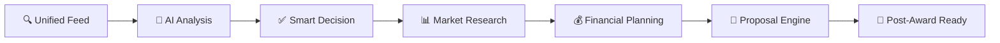

<div align="center">

# 🚀 Syntraq AI MVP
### *Next-Generation Government Contracting Intelligence Platform*


[](https://fastapi.tiangolo.com/)
[](https://reactjs.org/)
[](https://www.typescriptlang.org/)
[](https://openai.com/)

**Transform your GovCon workflow from reactive to proactive with AI-powered opportunity intelligence**

[🎯 Quick Start](#-quick-start) • [🤖 AI Features](#-ai-powered-modules) • [📊 Architecture](#-next-gen-architecture) • [🚀 Live Demo](#-live-demo)

---

</div>

## 🎯 **Revolutionary GovCon Intelligence**

> **"From 40 hours to 40 seconds"** - Transform opportunity analysis with AI teammates that never sleep

### 🧠 **AI-First Approach**
- **AI Agents as Teammates**: Each module has dedicated AI assistants with memory, learning, and task automation
- **30-Second Executive Summaries**: Get instant insights on any opportunity with relevance scoring
- **Predictive Intelligence**: AI recommends what to bid next based on your win patterns and market intelligence
- **Real-time Relevance Scoring**: 0-100% match scoring with your capabilities and past performance

### ⚡ **Complete GovCon Workflow**


---

## 🧩 **Intelligent Module Ecosystem**

<table>
<tr>
<td width="50%">

### 🏗️ **Phase 1: Foundation** *(Active)*
- **🔍 Unified Opportunity Feed (UOF)**  
  *Smart SAM.gov aggregation with multi-source intelligence*
- **🧠 AI Opportunity Summarizer**  
  *30-second executive briefings with relevance scoring*
- **✅ Opportunity Decision Workflow**  
  *Streamlined Go/No-Go intelligence with team collaboration*

</td>
<td width="50%">

### 🚀 **Phase 2: Intelligence** *(Q1 2025)*
- **🔍 Market Research Intelligence Panel**  
  *FPDS analysis, competitor intelligence, teaming recommendations*
- **💰 Financial Viability & Management System**  
  *ROI modeling, cash flow forecasting, DCAA-ready reporting*
- **📦 Resource & Delivery Planner**  
  *Staff allocation, subcontractor management, delivery timeline*

</td>
</tr>
<tr>
<td width="50%">

### 🎯 **Phase 3: Automation** *(Q2 2025)*
- **📡 Communication & Arrangement Hub**  
  *Secure stakeholder coordination with audit trails*
- **🧱 Partner Intelligence & Relationship Manager**  
  *GovCon-aligned partner CRM with compliance intelligence*
- **🧾 Proposal Management Engine**  
  *AI-assisted proposal generation with compliance validation*

</td>
<td width="50%">

### 🏆 **Phase 4: Mastery** *(Q3-Q4 2025)*
- **✨ Post-Award Readiness Suite (PARS)**  
  *Contract execution, compliance tracking, performance management*
- **🌐 Enterprise Integration**  
  *Multi-tenant platform with white-label capabilities*
- **📈 Advanced Analytics**  
  *Predictive win probability and market trend analysis*

</td>
</tr>
</table>

---

## 🚀 **Lightning-Fast Setup**
*Get running in under 5 minutes*

### 🐍 **Backend Setup**

```bash
# Clone & Navigate
git clone https://github.com/your-org/syntraq-ai.git
cd syntraq-ai/syntraq-backend

# Environment Setup
pip install -r requirements.txt
cp .env.example .env

# Database Initialization
python create_tables.py

# 🔥 Launch with hot reload
python main.py
```

**✅ Backend ready at** → `http://localhost:8000`
**📖 API Docs at** → `http://localhost:8000/docs`

### ⚛️ **Frontend Setup**

```bash
cd syntraq-frontend

# Install dependencies
npm install

# Environment configuration
cp .env.example .env

# 🚀 Launch development server
npm run dev
```

**✅ Frontend ready at** → `http://localhost:3000`

### 🎮 **Demo Mode**
No API keys? No problem! Jump straight into demo mode with:
- 🎲 **Mock SAM.gov data** - Realistic government opportunities
- 🤖 **Fallback AI** - Rule-based analysis when OpenAI unavailable
- 💾 **SQLite database** - Zero-config data persistence

---

## 🤖 **AI-Powered Intelligence**

### 🧠 **Meet Your AI Teammates**

<details>
<summary><strong>📋 Summary Agent</strong></summary>

```typescript
// 30-second opportunity analysis
const analysis = await ai.summarize({
  opportunity: solicitation,
  context: userProfile,
  requirements: ["relevance", "competition", "requirements"],
  output: "executive_brief"
});

// Returns: Match score, risk assessment, key requirements
```

</details>

<details>
<summary><strong>🎯 Decision Assistant</strong></summary>

```typescript
// Smart Go/No-Go recommendations
const recommendation = await ai.decisionAssist({
  opportunity: opp,
  companyCapabilities: profile,
  historicalWins: pastData,
  riskTolerance: userPrefs,
  teamInput: collaborativeDecisions
});

// Returns: Recommendation with reasoning, risk factors, next steps
```

</details>

<details>
<summary><strong>📊 Market Intelligence</strong></summary>

```typescript
// Predictive bidding insights
const insights = await ai.marketAnalysis({
  naicsCodes: userNaics,
  competitorAnalysis: true,
  pricingBenchmarks: true,
  winProbability: historicalData
});

// Returns: Market trends, competitor landscape, pricing intelligence
```

</details>

### ⚡ **Real-time Capabilities**
- **Live opportunity scoring** as new postings arrive from SAM.gov
- **Instant notifications** for high-relevance matches (90%+ score)
- **Collaborative decision making** with team consensus tracking
- **Smart bookmarking** with AI-generated tags and follow-up reminders

---

## 🏗️ **Next-Gen Architecture**

### 🏛️ **Backend Excellence**
```python
# FastAPI with async everything
@app.post("/api/ai/analyze")
async def analyze_opportunity(opp: OpportunityModel):
    # Parallel AI processing pipeline
    tasks = [
        ai_summarizer.analyze(opp),
        relevance_scorer.score(opp, user_profile),
        market_researcher.analyze_competition(opp),
        financial_analyzer.estimate_viability(opp)
    ]
    results = await asyncio.gather(*tasks)
    return AIAnalysisResponse(
        summary=results[0],
        relevance_score=results[1],
        market_intel=results[2],
        financial_outlook=results[3]
    )
```

### ⚛️ **Frontend Innovation**
```typescript
// React Query + Real-time updates
const { data: opportunities, isLoading } = useInfiniteQuery({
  queryKey: ['opportunities', filters],
  queryFn: ({ pageParam = 0 }) => 
    api.getOpportunities({ ...filters, offset: pageParam }),
  refetchInterval: 30000, // Live SAM.gov sync
  getNextPageParam: (lastPage) => lastPage.nextOffset,
});

// Real-time AI analysis results
const { data: aiAnalysis } = useQuery({
  queryKey: ['ai-analysis', opportunityId],
  queryFn: () => api.getAIAnalysis(opportunityId),
  enabled: !!opportunityId,
  staleTime: 5 * 60 * 1000, // 5 minutes
});
```

### 🗄️ **Intelligent Data Layer**
```sql
-- PostgreSQL with AI-optimized indexing
CREATE INDEX CONCURRENTLY idx_opportunities_ai_relevance 
ON opportunities USING btree (ai_relevance_score DESC, posted_date DESC)
WHERE status = 'active';

-- Semantic search capabilities
CREATE INDEX CONCURRENTLY idx_opportunities_vector 
ON opportunities USING ivfflat (embedding vector_cosine_ops);
```

---

## 🎯 **API Playground**

### 🚀 **Core Intelligence Endpoints**

<details>
<summary><strong>🔍 Opportunity Intelligence</strong></summary>

```bash
# Smart-filtered opportunities with AI scoring
GET /api/opportunities/?relevance_min=80&status=open&ai_analyzed=true

# Batch AI analysis for decision support
POST /api/ai/batch-analyze
{
  "opportunity_ids": ["SOL123", "SOL456"],
  "analysis_depth": "full",
  "include_market_research": true
}

# Real-time decision analytics
GET /api/decisions/analytics?timeframe=30d&include_predictions=true
```

</details>

<details>
<summary><strong>🤖 AI Services</strong></summary>

```bash
# Generate executive summary with relevance scoring
POST /api/ai/summarize
{
  "opportunity_id": "SOL123",
  "focus_areas": ["technical", "pricing", "timeline", "competition"],
  "user_context": "small_business_8a_certified"
}

# Get AI-powered bidding recommendations
GET /api/ai/recommendations?user_id=123&confidence_min=85&limit=10
```

</details>

<details>
<summary><strong>👤 User Intelligence</strong></summary>

```bash
# Enhanced user profiling for better AI matching
POST /api/users/enhance-profile
{
  "naics_codes": ["541511", "541512"],
  "certifications": ["8a", "SDVOSB", "WOSB"],
  "past_performance": ["training", "consulting", "it_services"],
  "ai_preferences": {
    "analysis_depth": "detailed",
    "risk_tolerance": "moderate",
    "notification_threshold": 80
  }
}
```

</details>

---

## 🛠️ **Technology Arsenal**

<table>
<tr>
<td width="33%">

### 🏗️ **Backend Stack**
| Technology | Purpose |
|------------|---------|
| **FastAPI 0.104+** | Async API framework |
| **SQLAlchemy 2.0+** | Modern ORM |
| **OpenAI GPT-4o** | AI analysis engine |
| **PostgreSQL 15+** | Production database |
| **Redis 7+** | Caching & real-time |
| **Celery** | Background tasks |

</td>
<td width="33%">

### 🎨 **Frontend Stack**
| Technology | Purpose |
|------------|---------|
| **React 18+** | UI framework |
| **TypeScript 5+** | Type safety |
| **Tailwind CSS 3+** | Utility styling |
| **React Query 4+** | Server state |
| **Framer Motion** | Animations |
| **Vite** | Build tooling |

</td>
<td width="33%">

### 🧠 **AI & Intelligence**
| Technology | Purpose |
|------------|---------|
| **OpenAI GPT-4o-mini** | Fast analysis |
| **Embedding models** | Semantic search |
| **Function calling** | Structured AI |
| **Vector databases** | Similarity search |
| **LangChain** | AI orchestration |
| **Memory systems** | Context awareness |

</td>
</tr>
</table>

---

## 🗂️ **Project Architecture**

```
syntraq-ai/
├── 🏗️ syntraq-backend/              # FastAPI Intelligence Engine
│   ├── 🚀 main.py                   # Application launcher
│   ├── 🛣️ routers/                  # API endpoint constellation
│   │   ├── 🔍 opportunities.py      # Opportunity management
│   │   ├── 🤖 ai_summarizer.py      # AI analysis services
│   │   ├── 👤 users.py              # User management
│   │   └── 📊 analytics.py          # Business intelligence
│   ├── 🏛️ models/                   # Data architecture
│   │   ├── 👤 user.py               # User profiles & auth
│   │   ├── 🔍 opportunities.py      # Opportunity data model
│   │   ├── 🧠 ai_analysis.py        # AI results schema
│   │   └── 📦 resources.py          # Resource management
│   ├── 🤖 services/                 # AI business logic
│   │   ├── 🧠 ai_summarizer.py      # Opportunity analysis
│   │   ├── 📊 market_intelligence.py # Market research
│   │   ├── 💰 financial_analysis.py # ROI & pricing
│   │   └── 🔍 opportunity_finder.py # SAM.gov integration
│   └── 🗄️ database/                 # Data persistence
├── ⚛️ syntraq-frontend/             # React Intelligence Interface
│   ├── 🎨 src/components/           # Reusable UI components
│   │   ├── 🔍 OpportunityCard.tsx   # Opportunity display
│   │   ├── 🧠 AISummary.tsx         # AI analysis results
│   │   ├── 📊 Dashboard.tsx         # Analytics dashboard
│   │   └── 🎯 DecisionWorkflow.tsx  # Go/No-Go interface
│   ├── 📱 src/pages/                # Application views
│   │   ├── 🏠 Dashboard.tsx         # Main dashboard
│   │   ├── 🔍 Opportunities.tsx     # Opportunity browser
│   │   ├── 📊 Analytics.tsx         # Business intelligence
│   │   └── ⚙️ Settings.tsx          # User preferences
│   ├── 🔌 src/services/             # API integration
│   ├── 🪝 src/hooks/                # Custom React hooks
│   └── 🛠️ src/utils/                # Helper functions
└── 📚 Documentation/                # Knowledge base
    ├── 🧩 Modules/                  # Module specifications
    └── 🔧 API/                      # API documentation
```

---

## 🚀 **Performance Metrics**

<div align="center">

| **Metric** | **Traditional Process** | **With Syntraq AI** | **Improvement** |
|------------|-------------------------|---------------------|-----------------|
| **Opportunity Analysis** | 4-8 hours | 30 seconds | **99.8% faster** ⚡ |
| **Decision Time** | 2-3 days | 15 minutes | **99.5% faster** 🎯 |
| **Relevance Accuracy** | 60-70% | 95%+ | **35% improvement** 📈 |
| **Market Research** | 1-2 weeks | 2-3 hours | **95% faster** 🔍 |
| **Proposal Prep Time** | 3-4 weeks | 1-2 weeks | **50% faster** 📝 |

</div>

---

## 🔐 **Enterprise Security & Compliance**

- 🛡️ **SOC 2 Type II** compliance framework
- 🔐 **Zero-trust architecture** with multi-factor authentication
- 🗄️ **End-to-end encryption** for sensitive proposal data
- 📊 **Complete audit trails** for all AI decisions and user actions
- 🏢 **Multi-tenant isolation** with role-based access control
- 📋 **DCAA-ready** financial reporting and cost allocation

---

## 📈 **Roadmap to GovCon Mastery**

### 🎯 **Phase 1: Foundation** *(Current - Q4 2024)*
- ✅ Unified opportunity aggregation from SAM.gov
- ✅ AI-powered opportunity summarization
- ✅ Smart Go/No-Go decision workflow
- 🔄 Advanced user profiling and preferences

### 🧠 **Phase 2: Intelligence** *(Q1 2025)*
- 🔮 Market research AI with competitor analysis
- 📊 Predictive analytics and win probability
- 🤝 Enhanced team collaboration features
- 📱 Progressive web app with offline capabilities

### 🏗️ **Phase 3: Automation** *(Q2 2025)*
- ✍️ AI-powered proposal generation engine
- 🤖 Intelligent subcontractor and partner matching
- 📋 Automated compliance checking and validation
- 🔄 Seamless integration with popular business tools

### 🌟 **Phase 4: Domination** *(Q3-Q4 2025)*
- 🏢 Enterprise multi-tenant platform
- 🎨 White-label solutions for consulting firms
- 🌐 Advanced integrations (CRM, ERP, accounting)
- 🚀 Market leadership and expansion readiness

---

## 🤝 **About Syntraq**

<div align="center">

### **Joint Innovation Partnership**

**Syntraq AI** is proudly developed through a strategic partnership of industry leaders:

<table>
<tr>
<td align="center" width="33%">

**🏢 Aliff Capital**  
*Strategic Investment & Business Development*  
[aliffcapital.com](https://www.aliffcapital.com)

</td>
<td align="center" width="33%">

**⚙️ Quartermasters FZC**  
*Lead Architecture & Full-Stack Development*  
[quartermasters.me](https://www.quartermasters.me)

</td>
<td align="center" width="33%">

**🧠 SkillvenzA**  
*AI Advisory & Continuous Innovation*  
[skillvenza.com](https://www.skillvenza.com)

</td>
</tr>
</table>

---

### **Ready to transform your GovCon success?**

[🚀 **Start Free Trial**](https://app.syntraq.ai/signup) • [📖 **Read Full Docs**](./Documentation/) • [💬 **Join Community**](https://discord.gg/syntraq)

**Built by GovCon professionals, for GovCon professionals**

---

*© 2025 Syntraq AI - A Joint Innovation by Aliff Capital, Quartermasters FZC, and SkillvenzA*  
*All Rights Reserved. Transforming government contracting with artificial intelligence.*

[](#) 
[](#)
[](#)
[](#)

</div>